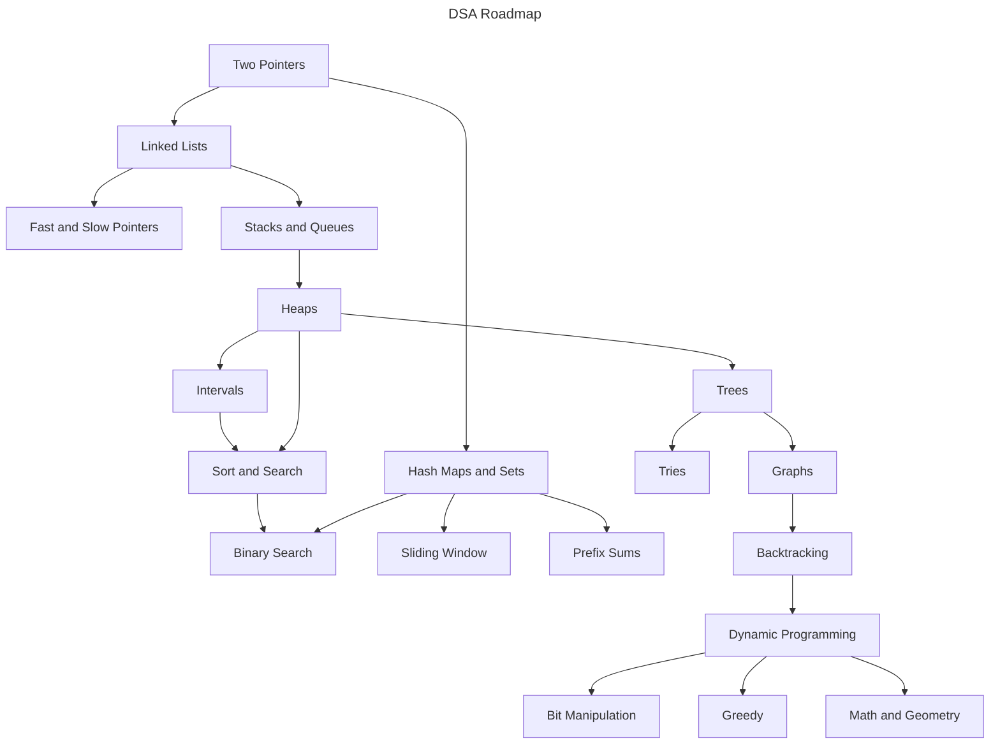

# LeetCode Patterns

Welcome to this **DSA roadmap** - a structured guide designed to help you **learn and master Data Structures and Algorithms (DSA)** efficiently.

## Why Did I Create This?

As a first-year university student, I set a goal to **master DSA as soon as possible** to prepare for my future career. Like many beginners, I started with **zero knowledge** about DSA and quickly realized that the vast number of coding problems available online was overwhelming. It was hard to figure out **where to start, what to focus on, and how to progress systematically**.

To solve this, I created this repository to **organize and simplify the learning process**. This roadmap is inspired by the [VNOI Roadmap](https://roadmap.sh/r/vnoi-roadmap), originally designed for **competitive programming**. However, I have adapted and restructured it to focus on **LeetCode-style problem-solving**, making it more suitable for **technical interviews and real-world coding assessments**.

## Prerequisites

Before diving into the roadmap, ensure you have a solid foundation in these key areas:

- Comfortable with at least **one programming language** (C++, Java, Python, etc.)
- Understanding of **basic programming concepts** (syntax, loops, functions, OOP)
- Familiarity with **arrays and linked lists**
- Basic knowledge of **recursion**
- Understanding of **Big-O notation** and **complexity analysis**
- Algebra fundamentals (**logarithms, exponents, modular arithmetic**)

## The Roadmap

This is my roadmap to learn DSA.

Each topic includes **curated LeetCode problems** and explanations to help you build a **strong problem-solving foundation**.
