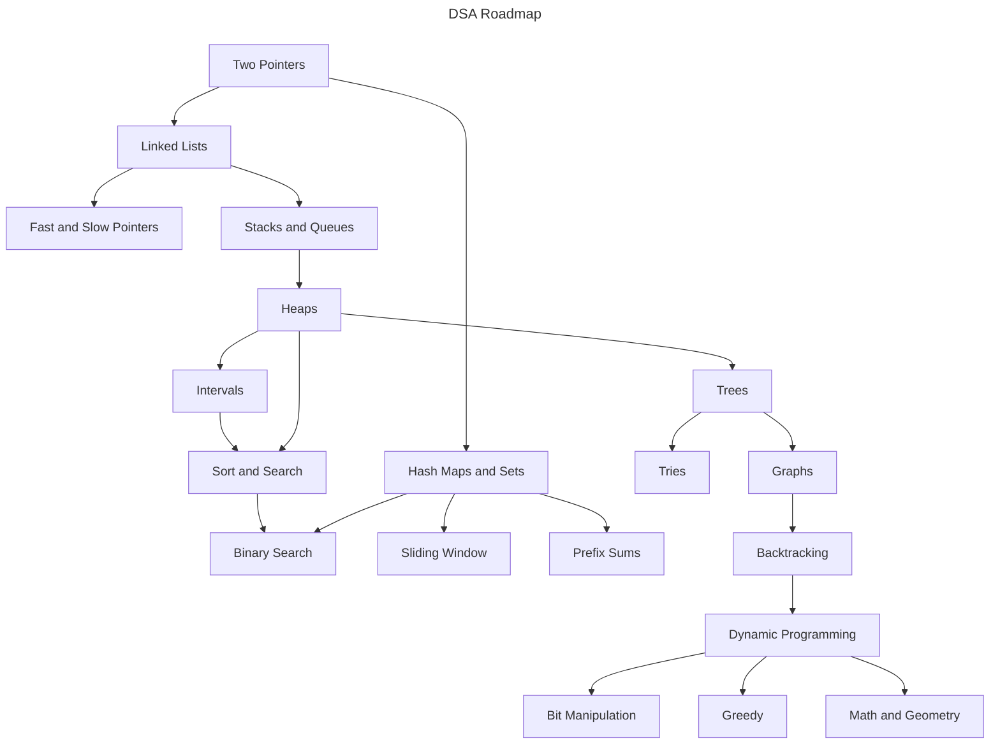

# LeetCode Patterns

Welcome to this **DSA Roadmap** - a structured guide designed to help you **learn and master Data Structures and Algorithms (DSA)** efficiently.

## 🌟 Why I Created This

As a first-year university student, I set a goal to **master DSA as soon as possible** to prepare for my future career. Like many beginners, I started with **zero knowledge** about DSA and quickly realized that the vast number of coding problems available online was overwhelming. It was hard to figure out **where to start, what to focus on, and how to progress systematically**.

To solve this, I created this repository to **organize and simplify the learning process**. This roadmap is inspired by the [VNOI Roadmap](https://roadmap.sh/r/vnoi-roadmap), originally designed for **competitive programming**. However, I have adapted and restructured it to focus on **LeetCode-style problem-solving**, making it more suitable for **technical interviews and real-world coding assessments**.

## 📚 Prerequisites

Before diving in, make sure you're comfortable with the following:

- One programming language (C++, Java, Python, etc.)
- Basic programming concepts (variables, loops, functions, OOP)
- Familiarity with arrays and linked lists
- Basic recursion
- Time and space complexity (Big-O notation)
- Algebra fundamentals (logarithms, exponents, modular arithmetic)

## 🗺️ The Roadmap

Here's the visual representation of my DSA learning path:

## 🚀 Let's Go

> [!NOTE]
> All solutions in this repository are written in **C++ only**. If you're not familiar with C++, I highly recommend learning the basic syntax and core concepts before diving into the problems.

### Two Pointers

| Link                                                                                                            | Solutions                                      | Difficulty |
| --------------------------------------------------------------------------------------------------------------- | ---------------------------------------------- | ---------- |
| [Valid Palindrome](https://leetcode.com/problems/valid-palindrome/)                                             | [C++](./src/solutions_125/solutions_125.hpp)   | Easy       |
| [Remove Element](https://leetcode.com/problems/remove-element/)                                                 | [C++](./src/solutions_27/solutions_27.hpp)     | Easy       |
| [Reverse String](https://leetcode.com/problems/reverse-string/)                                                 | [C++](./src/solutions_344/solutions_344.hpp)   | Easy       |
| [Container With Most Water](https://leetcode.com/problems/container-with-most-water/)                           | [C++](./src/solutions_11/solutions_11.hpp)     | Medium     |
| [Merge Two 2D Arrays by Summing Values](https://leetcode.com/problems/merge-two-2d-arrays-by-summing-values/)   | [C++](./src/solutions_2570/solutions_2570.hpp) | Easy       |
| [Merge Sorted Array](https://leetcode.com/problems/merge-sorted-array/)                                         | [C++](./src/solutions_88/solutions_88.hpp)     | Easy       |
| [Remove Duplicates from Sorted Array](https://leetcode.com/problems/remove-duplicates-from-sorted-array/)       | [C++](./src/solutions_26/solutions_26.hpp)     | Easy       |
| [Two Sum II - Input Array Is Sorted](https://leetcode.com/problems/two-sum-ii-input-array-is-sorted/)           | [C++](./src/solutions_167/solutions_167.hpp)   | Medium     |
| [3Sum](https://leetcode.com/problems/3sum/)                                                                     | [C++](./src/solutions_15/solutions_15.hpp)     | Medium     |
| [Longest Palindromic Substring](https://leetcode.com/problems/longest-palindromic-substring/)                   | [C++](./src/solutions_5/solutions_5.hpp)       | Medium     |
| [Next Permutation](https://leetcode.com/problems/next-permutation/)                                             | [C++](./src/solutions_31/solutions_31.hpp)     | Medium     |
| [Remove Duplicates from Sorted Array II](https://leetcode.com/problems/remove-duplicates-from-sorted-array-ii/) | Pending                                        | Medium     |
| [Rotate Array](https://leetcode.com/problems/rotate-array/)                                                     | [C++](./src/solutions_189/solutions_189.hpp)   | Medium     |

### Linked Lists

| Link                                                                                                              | Solutions                                    | Difficulty |
| ----------------------------------------------------------------------------------------------------------------- | -------------------------------------------- | ---------- |
| [Add Two Numbers](https://leetcode.com/problems/add-two-numbers/)                                                 | [C++](./src/solutions_2/solutions_2.hpp)     | Medium     |
| [Flatten a Multilevel Doubly Linked List](https://leetcode.com/problems/flatten-a-multilevel-doubly-linked-list/) | [C++](./src/solutions_430/solutions_430.hpp) | Medium     |
| [Remove Nth Node From End of List](https://leetcode.com/problems/remove-nth-node-from-end-of-list/)               | [C++](./src/solutions_19/solutions_19.hpp)   | Medium     |
| [Middle of the Linked List](https://leetcode.com/problems/middle-of-the-linked-list/)                             | [C++](./src/solutions_876/solutions_876.hpp) | Easy       |
| [Intersection of Two Linked Lists](https://leetcode.com/problems/intersection-of-two-linked-lists/)               | Pending                                      | Easy       |
| [Linked List Cycle](https://leetcode.com/problems/linked-list-cycle/)                                             | [C++](./src/solutions_141/solutions_141.hpp) | Easy       |

### Hash Maps and Hash Sets

| Link                                                                                                          | Solutions                                      | Difficulty |
| ------------------------------------------------------------------------------------------------------------- | ---------------------------------------------- | ---------- |
| [LRU Cache](https://leetcode.com/problems/lru-cache/)                                                         | [C++](./src/solutions_146/solutions_146.hpp)   | Medium     |
| [Two Sum](https://leetcode.com/problems/two-sum/)                                                             | [C++](./src/solutions_1/solutions_1.hpp)       | Easy       |
| [Find Missing and Repeated Values](https://leetcode.com/problems/find-missing-and-repeated-values/)           | [C++](./src/solutions_2965/solutions_2965.hpp) | Easy       |
| [Merge Two 2D Arrays by Summing Values](https://leetcode.com/problems/merge-two-2d-arrays-by-summing-values/) | [C++](./src/solutions_2570/solutions_2570.hpp) | Easy       |
| [Number of Good Pairs](https://leetcode.com/problems/number-of-good-pairs/)                                   | [C++](./src/solutions_1512/solutions_1512.hpp) | Easy       |
| [Roman to Integer](https://leetcode.com/problems/roman-to-integer/)                                           | Pending                                        | Easy       |
| [Valid Sudoku](https://leetcode.com/problems/valid-sudoku/)                                                   | [C++](./src/solutions_36/solutions_36.hpp)     | Medium     |
| [Longest Consecutive Sequence](https://leetcode.com/problems/longest-consecutive-sequence/)                   | Pending                                        | Medium     |
| [Set Matrix Zeroes](https://leetcode.com/problems/set-matrix-zeroes/)                                         | [C++](./src/solutions_73/solutions_73.hpp)     | Medium     |

### Sliding Window

| Link                                                                                                                                        | Solutions                                      | Difficulty |
| ------------------------------------------------------------------------------------------------------------------------------------------- | ---------------------------------------------- | ---------- |
| [Longest Substring Without Repeating Characters](https://leetcode.com/problems/longest-substring-without-repeating-characters/)             | [C++](./src/solutions_3/solutions_3.hpp)       | Medium     |
| [Number of Substrings Containing All Three Characters](https://leetcode.com/problems/number-of-substrings-containing-all-three-characters/) | [C++](./src/solutions_1358/solutions_1358.hpp) | Medium     |
| [Longest Repeating Character Replacement](https://leetcode.com/problems/longest-repeating-character-replacement/)                           | [C++](./src/solutions_424/solutions_424.hpp)   | Medium     |

### Binary Search

| Link                                                                                                                                              | Solutions                                                    | Difficulty |
| ------------------------------------------------------------------------------------------------------------------------------------------------- | ------------------------------------------------------------ | ---------- |
| [Binary Search](https://leetcode.com/problems/binary-search/)                                                                                     | [C++](./src/solutions_704/solutions_704.hpp)                 | Easy       |
| [Maximum Count of Positive Integer and Negative Integer](https://leetcode.com/problems/maximum-count-of-positive-integer-and-negative-integer/)   | [C++](./src/solutions_2529/solutions_2529.hpp)               | Easy       |
| [Find First and Last Position of Element in Sorted Array](https://leetcode.com/problems/find-first-and-last-position-of-element-in-sorted-array/) | [C++](./src/solutions_34/solutions_34.hpp)                   | Medium     |
| [WoodCutting Made Easy](https://www.interviewbit.com/problems/woodcutting-made-easy/)                                                             | [C++](./src/solutions_woodcutting/solutions_woodcutting.hpp) | Medium     |
| [Search in Rotated Sorted Array](https://leetcode.com/problems/search-in-rotated-sorted-array/)                                                   | [C++](./src/solutions_33/solutions_33.hpp)                   | Medium     |
| [Median of Two Sorted Arrays](https://leetcode.com/problems/median-of-two-sorted-arrays/)                                                         | [C++](./src/solutions_4/solutions_4.hpp)                     | Hard       |
| [Search a 2D Matrix](https://leetcode.com/problems/search-a-2d-matrix/)                                                                           | [C++](./src/solutions_74/solutions_74.hpp)                   | Medium     |
| [Find Peak Element](https://leetcode.com/problems/find-peak-element/)                                                                             | [C++](./src/solutions_162/solutions_162.hpp)                 | Medium     |
| [Random Pick with Weight](https://leetcode.com/problems/random-pick-with-weight/)                                                                 | [C++](./src/solutions_528/solutions_528.hpp)                 | Medium     |

### Math

| Link                                                                                                                      | Solutions                                      | Difficulty |
| ------------------------------------------------------------------------------------------------------------------------- | ---------------------------------------------- | ---------- |
| [Check if Number is a Sum of Powers of Three](https://leetcode.com/problems/check-if-number-is-a-sum-of-powers-of-three/) | [C++](./src/solutions_1780/solutions_1780.hpp) | Medium     |
| [Closest Prime Numbers in Range](https://leetcode.com/problems/closest-prime-numbers-in-range/)                           | [C++](./src/solutions_2523/solutions_2523.hpp) | Medium     |
| [Reverse Integer](https://leetcode.com/problems/reverse-integer/)                                                         | [C++](./src/solutions_7/solutions_7.hpp)       | Medium     |
| [Stone Removal Game](https://leetcode.com/problems/stone-removal-game/)                                                   | Pending                                        | Easy       |
| [Water Bottles](https://leetcode.com/problems/water-bottles/)                                                             | [C++](./src/solutions_1518/solutions_1518.hpp) | Easy       |
| [Count Primes](https://leetcode.com/problems/count-primes/)                                                               | [C++](./src/solutions_204/solutions_204.hpp)   | Medium     |
| [Add Digits](https://leetcode.com/problems/add-digits/)                                                                   | [C++](./src/solutions_258/solutions_258.hpp)   | Easy       |
| [Palindrome Number](https://leetcode.com/problems/palindrome-number/)                                                     | [C++](./src/solutions_9/solutions_9.hpp)       | Easy       |
| [Power of Two](https://leetcode.com/problems/power-of-two/)                                                               | [C++](./src/solutions_231/solutions_231.hpp)   | Easy       |
| [Pow(x, n)](https://leetcode.com/problems/powx-n/)                                                                        | [C++](./src/solutions_50/solutions_50.hpp)     | Medium     |
| [Basic Calculator II](https://leetcode.com/problems/basic-calculator-ii/)                                                 | [C++](./src/solutions_227/solutions_227.hpp)   | Medium     |

### Stacks and Queues

| Link                                                                                                                | Solutions                                    | Difficulty |
| ------------------------------------------------------------------------------------------------------------------- | -------------------------------------------- | ---------- |
| [Valid Parentheses](https://leetcode.com/problems/valid-parentheses/)                                               | [C++](./src/solutions_20/solutions_20.hpp)   | Easy       |
| [Next Greater Element II](https://leetcode.com/problems/next-greater-element-ii/)                                   | Pending                                      | Medium     |
| [Basic Calculator](https://leetcode.com/problems/basic-calculator/)                                                 | [C++](./src/solutions_224/solutions_224.hpp) | Hard       |
| [Remove All Adjacent Duplicates In String](https://leetcode.com/problems/remove-all-adjacent-duplicates-in-string/) | Pending                                      | Easy       |
| [Implement Queue using Stacks](https://leetcode.com/problems/implement-queue-using-stacks/)                         | Pending                                      | Easy       |
| [Sliding Window Maximum](https://leetcode.com/problems/sliding-window-maximum/)                                     | [C++](./src/solutions_239/solutions_239.hpp) | Hard       |

### Heaps

| Link                                                                                              | Solutions                                    | Difficulty |
| ------------------------------------------------------------------------------------------------- | -------------------------------------------- | ---------- |
| [Top K Frequent Elements](https://leetcode.com/problems/top-k-frequent-elements/)                 | Pending                                      | Medium     |
| [Top K Frequent Words](https://leetcode.com/problems/top-k-frequent-words/)                       | [C++](./src/solutions_692/solutions_692.hpp) | Medium     |
| [Merge k Sorted Lists](https://leetcode.com/problems/merge-k-sorted-lists/)                       | [C++](./src/solutions_23/solutions_23.hpp)   | Hard       |
| [Find Median from Data Stream](https://leetcode.com/problems/find-median-from-data-stream/)       | [C++](./src/solutions_295/solutions_295.hpp) | Hard       |
| [Kth Largest Element in an Array](https://leetcode.com/problems/kth-largest-element-in-an-array/) | [C++](./src/solutions_215/solutions_215.hpp) | Medium     |

### Backtracking

| Link                                                              | Solutions | Difficulty |
| ----------------------------------------------------------------- | --------- | ---------- |
| [Permutations](https://leetcode.com/problems/permutations/)       | Pending   | Medium     |
| [Permutations II](https://leetcode.com/problems/permutations-ii/) | Pending   | Medium     |
| [Combinations](https://leetcode.com/problems/combinations/)       | Pending   | Medium     |
| [Subsets](https://leetcode.com/problems/subsets/)                 | Pending   | Medium     |

### Sort and Search

| Link                                                          | Solutions | Difficulty |
| ------------------------------------------------------------- | --------- | ---------- |
| [Sort an Array](https://leetcode.com/problems/sort-an-array/) | Pending   | Medium     |

### Must try

| Link                                                                                                              | Solutions                                    | Difficulty |
| ----------------------------------------------------------------------------------------------------------------- | -------------------------------------------- | ---------- |
| [Longest Common Prefix](https://leetcode.com/problems/longest-common-prefix/)                                     | [C++](./src/solutions_14/solutions_14.hpp)   | Easy       |
| [String to Integer (atoi)](https://leetcode.com/problems/string-to-integer-atoi/)                                 | [C++](./src/solutions_8/solutions_8.hpp)     | Medium     |
| [Largest Number At Least Twice of Others](https://leetcode.com/problems/largest-number-at-least-twice-of-others/) | [C++](./src/solutions_747/solutions_747.hpp) | Easy       |
| [Flood Fill](https://leetcode.com/problems/flood-fill/)                                                           | [C++](./src/solutions_733/solutions_733.hpp) | Easy       |

## 📌 Final Thoughts

This roadmap is a **living document**. I will continue to refine it as I grow and learn more.
Whether you're just starting out or revisiting DSA for interviews, I hope this resource helps guide your journey.

Happy coding! ✨
