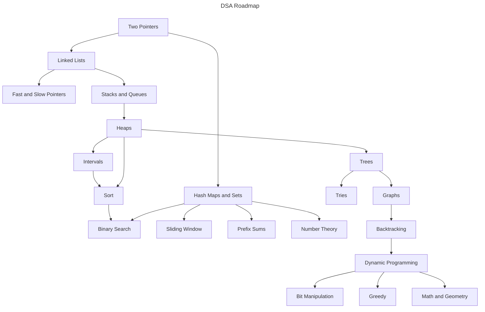

# LeetCode Patterns

Hello 😹, welcome to this LeetCode roadmap.

## 🗺️ The Roadmap

## 🚀 Let's Go

> [!NOTE]
> All solutions in this repository are written in **C++ only**. If you're not familiar with C++, I highly recommend learning the basic syntax and core concepts before diving into the problems. You can find a great resource for learning C++ [here](https://www.learncpp.com/).

### Two Pointers

| Link                                                                                                            | Solutions                                      | Difficulty |
| --------------------------------------------------------------------------------------------------------------- | ---------------------------------------------- | ---------- |
| [Valid Palindrome](https://leetcode.com/problems/valid-palindrome/)                                             | [C++](./src/solutions_125/solutions_125.hpp)   | Easy       |
| [Remove Element](https://leetcode.com/problems/remove-element/)                                                 | [C++](./src/solutions_27/solutions_27.hpp)     | Easy       |
| [Reverse String](https://leetcode.com/problems/reverse-string/)                                                 | [C++](./src/solutions_344/solutions_344.hpp)   | Easy       |
| [Container With Most Water](https://leetcode.com/problems/container-with-most-water/)                           | [C++](./src/solutions_11/solutions_11.hpp)     | Medium     |
| [Merge Two 2D Arrays by Summing Values](https://leetcode.com/problems/merge-two-2d-arrays-by-summing-values/)   | [C++](./src/solutions_2570/solutions_2570.hpp) | Easy       |
| [Merge Sorted Array](https://leetcode.com/problems/merge-sorted-array/)                                         | [C++](./src/solutions_88/solutions_88.hpp)     | Easy       |
| [Remove Duplicates from Sorted Array](https://leetcode.com/problems/remove-duplicates-from-sorted-array/)       | [C++](./src/solutions_26/solutions_26.hpp)     | Easy       |
| [Two Sum II - Input Array Is Sorted](https://leetcode.com/problems/two-sum-ii-input-array-is-sorted/)           | [C++](./src/solutions_167/solutions_167.hpp)   | Medium     |
| [3Sum](https://leetcode.com/problems/3sum/)                                                                     | [C++](./src/solutions_15/solutions_15.hpp)     | Medium     |
| [Longest Palindromic Substring](https://leetcode.com/problems/longest-palindromic-substring/)                   | [C++](./src/solutions_5/solutions_5.hpp)       | Medium     |
| [Next Permutation](https://leetcode.com/problems/next-permutation/)                                             | [C++](./src/solutions_31/solutions_31.hpp)     | Medium     |
| [Remove Duplicates from Sorted Array II](https://leetcode.com/problems/remove-duplicates-from-sorted-array-ii/) | [C++](./src/solutions_80/solutions_80.hpp)     | Medium     |
| [Rotate Array](https://leetcode.com/problems/rotate-array/)                                                     | [C++](./src/solutions_189/solutions_189.hpp)   | Medium     |

### Linked Lists

| Link                                                                                                                               | Solutions                                    | Difficulty |
| ---------------------------------------------------------------------------------------------------------------------------------- | -------------------------------------------- | ---------- |
| [Add Two Numbers](https://leetcode.com/problems/add-two-numbers/)                                                                  | [C++](./src/solutions_2/solutions_2.hpp)     | Medium     |
| [Reverse Linked List II](https://leetcode.com/problems/reverse-linked-list-ii?envType=problem-list-v2&envId=linked-list)           | [C++](./src/solutions_92/solutions_92.hpp)   | Medium     |
| [Rotate List](https://leetcode.com/problems/rotate-list)                                                                           | [C++](./src/solutions_61/solutions_61.hpp)   | Medium     |
| [Flatten a Multilevel Doubly Linked List](https://leetcode.com/problems/flatten-a-multilevel-doubly-linked-list/)                  | [C++](./src/solutions_430/solutions_430.hpp) | Medium     |
| [Remove Linked List Elements](https://leetcode.com/problems/remove-linked-list-elements?envType=problem-list-v2&envId=linked-list) | [C++](./src/solutions_203/solutions_203.hpp) | Easy       |
| [Remove Nth Node From End of List](https://leetcode.com/problems/remove-nth-node-from-end-of-list/)                                | [C++](./src/solutions_19/solutions_19.hpp)   | Medium     |
| [Middle of the Linked List](https://leetcode.com/problems/middle-of-the-linked-list/)                                              | [C++](./src/solutions_876/solutions_876.hpp) | Easy       |
| [Intersection of Two Linked Lists](https://leetcode.com/problems/intersection-of-two-linked-lists/)                                | [C++](./src/solutions_160/solutions_160.hpp) | Easy       |
| [Linked List Cycle](https://leetcode.com/problems/linked-list-cycle/)                                                              | [C++](./src/solutions_141/solutions_141.hpp) | Easy       |
| [Swap Nodes in Pairs](https://leetcode.com/problems/swap-nodes-in-pairs)                                                           | [C++](./src/solutions_24/solutions_24.hpp)   | Medium     |

### Hash Maps and Hash Sets

| Link                                                                                                          | Solutions                                      | Difficulty |
| ------------------------------------------------------------------------------------------------------------- | ---------------------------------------------- | ---------- |
| [LRU Cache](https://leetcode.com/problems/lru-cache/)                                                         | [C++](./src/solutions_146/solutions_146.hpp)   | Medium     |
| [Two Sum](https://leetcode.com/problems/two-sum/)                                                             | [C++](./src/solutions_1/solutions_1.hpp)       | Easy       |
| [Find Missing and Repeated Values](https://leetcode.com/problems/find-missing-and-repeated-values/)           | [C++](./src/solutions_2965/solutions_2965.hpp) | Easy       |
| [Merge Two 2D Arrays by Summing Values](https://leetcode.com/problems/merge-two-2d-arrays-by-summing-values/) | [C++](./src/solutions_2570/solutions_2570.hpp) | Easy       |
| [Number of Good Pairs](https://leetcode.com/problems/number-of-good-pairs/)                                   | [C++](./src/solutions_1512/solutions_1512.hpp) | Easy       |
| [Roman to Integer](https://leetcode.com/problems/roman-to-integer/)                                           | [C++](./src/solutions_13/solutions_13.hpp)     | Easy       |
| [Valid Sudoku](https://leetcode.com/problems/valid-sudoku/)                                                   | [C++](./src/solutions_36/solutions_36.hpp)     | Medium     |
| [Longest Consecutive Sequence](https://leetcode.com/problems/longest-consecutive-sequence/)                   | [C++](./src/solutions_128/solutions_128.hpp)   | Medium     |
| [Set Matrix Zeroes](https://leetcode.com/problems/set-matrix-zeroes/)                                         | [C++](./src/solutions_73/solutions_73.hpp)     | Medium     |
| [Contains Duplicate II](https://leetcode.com/problems/contains-duplicate-ii/)                                 | [C++](./src/solutions_219/solutions_219.hpp)   | Easy       |

### Sliding Window

| Link                                                                                                                                        | Solutions                                      | Difficulty |
| ------------------------------------------------------------------------------------------------------------------------------------------- | ---------------------------------------------- | ---------- |
| [Longest Substring Without Repeating Characters](https://leetcode.com/problems/longest-substring-without-repeating-characters/)             | [C++](./src/solutions_3/solutions_3.hpp)       | Medium     |
| [Number of Substrings Containing All Three Characters](https://leetcode.com/problems/number-of-substrings-containing-all-three-characters/) | [C++](./src/solutions_1358/solutions_1358.hpp) | Medium     |
| [Longest Repeating Character Replacement](https://leetcode.com/problems/longest-repeating-character-replacement/)                           | [C++](./src/solutions_424/solutions_424.hpp)   | Medium     |

### Binary Search

| Link                                                                                                                                              | Solutions                                                    | Difficulty |
| ------------------------------------------------------------------------------------------------------------------------------------------------- | ------------------------------------------------------------ | ---------- |
| [Binary Search](https://leetcode.com/problems/binary-search/)                                                                                     | [C++](./src/solutions_704/solutions_704.hpp)                 | Easy       |
| [Maximum Count of Positive Integer and Negative Integer](https://leetcode.com/problems/maximum-count-of-positive-integer-and-negative-integer/)   | [C++](./src/solutions_2529/solutions_2529.hpp)               | Easy       |
| [Find First and Last Position of Element in Sorted Array](https://leetcode.com/problems/find-first-and-last-position-of-element-in-sorted-array/) | [C++](./src/solutions_34/solutions_34.hpp)                   | Medium     |
| [WoodCutting Made Easy](https://www.interviewbit.com/problems/woodcutting-made-easy/)                                                             | [C++](./src/solutions_woodcutting/solutions_woodcutting.hpp) | Medium     |
| [Search in Rotated Sorted Array](https://leetcode.com/problems/search-in-rotated-sorted-array/)                                                   | [C++](./src/solutions_33/solutions_33.hpp)                   | Medium     |
| [Median of Two Sorted Arrays](https://leetcode.com/problems/median-of-two-sorted-arrays/)                                                         | [C++](./src/solutions_4/solutions_4.hpp)                     | Hard       |
| [Search a 2D Matrix](https://leetcode.com/problems/search-a-2d-matrix/)                                                                           | [C++](./src/solutions_74/solutions_74.hpp)                   | Medium     |
| [Find Peak Element](https://leetcode.com/problems/find-peak-element/)                                                                             | [C++](./src/solutions_162/solutions_162.hpp)                 | Medium     |
| [Random Pick with Weight](https://leetcode.com/problems/random-pick-with-weight/)                                                                 | [C++](./src/solutions_528/solutions_528.hpp)                 | Medium     |

### Math

| Link                                                                                                                      | Solutions                                      | Difficulty |
| ------------------------------------------------------------------------------------------------------------------------- | ---------------------------------------------- | ---------- |
| [Check if Number is a Sum of Powers of Three](https://leetcode.com/problems/check-if-number-is-a-sum-of-powers-of-three/) | [C++](./src/solutions_1780/solutions_1780.hpp) | Medium     |
| [Reverse Integer](https://leetcode.com/problems/reverse-integer/)                                                         | [C++](./src/solutions_7/solutions_7.hpp)       | Medium     |
| [Stone Removal Game](https://leetcode.com/problems/stone-removal-game/)                                                   | [C++](./src/solutions_3360/solutions_3360.hpp) | Easy       |
| [Water Bottles](https://leetcode.com/problems/water-bottles/)                                                             | [C++](./src/solutions_1518/solutions_1518.hpp) | Easy       |
| [Add Digits](https://leetcode.com/problems/add-digits/)                                                                   | [C++](./src/solutions_258/solutions_258.hpp)   | Easy       |
| [Palindrome Number](https://leetcode.com/problems/palindrome-number/)                                                     | [C++](./src/solutions_9/solutions_9.hpp)       | Easy       |
| [Power of Two](https://leetcode.com/problems/power-of-two/)                                                               | [C++](./src/solutions_231/solutions_231.hpp)   | Easy       |
| [Pow(x, n)](https://leetcode.com/problems/powx-n/)                                                                        | [C++](./src/solutions_50/solutions_50.hpp)     | Medium     |
| [Basic Calculator II](https://leetcode.com/problems/basic-calculator-ii/)                                                 | [C++](./src/solutions_227/solutions_227.hpp)   | Medium     |
| [Rotate Image](https://leetcode.com/problems/rotate-image)                                                                | [C++](./src/solutions_48/solutions_48.hpp)     | Medium     |

### Stacks and Queues

| Link                                                                                                                | Solutions                                      | Difficulty |
| ------------------------------------------------------------------------------------------------------------------- | ---------------------------------------------- | ---------- |
| [Valid Parentheses](https://leetcode.com/problems/valid-parentheses/)                                               | [C++](./src/solutions_20/solutions_20.hpp)     | Easy       |
| [Next Greater Element II](https://leetcode.com/problems/next-greater-element-ii/)                                   | [C++](./src/solutions_503/solutions_503.hpp)   | Medium     |
| [Basic Calculator](https://leetcode.com/problems/basic-calculator/)                                                 | [C++](./src/solutions_224/solutions_224.hpp)   | Hard       |
| [Remove All Adjacent Duplicates In String](https://leetcode.com/problems/remove-all-adjacent-duplicates-in-string/) | [C++](./src/solutions_1047/solutions_1047.hpp) | Easy       |
| [Implement Queue using Stacks](https://leetcode.com/problems/implement-queue-using-stacks/)                         | [C++](./src/solutions_232/solutions_232.hpp)   | Easy       |
| [Sliding Window Maximum](https://leetcode.com/problems/sliding-window-maximum/)                                     | [C++](./src/solutions_239/solutions_239.hpp)   | Hard       |

### Heaps

| Link                                                                                              | Solutions                                    | Difficulty |
| ------------------------------------------------------------------------------------------------- | -------------------------------------------- | ---------- |
| [Top K Frequent Elements](https://leetcode.com/problems/top-k-frequent-elements/)                 | [C++](./src/solutions_347/solutions_347.hpp) | Medium     |
| [Top K Frequent Words](https://leetcode.com/problems/top-k-frequent-words/)                       | [C++](./src/solutions_692/solutions_692.hpp) | Medium     |
| [Merge k Sorted Lists](https://leetcode.com/problems/merge-k-sorted-lists/)                       | [C++](./src/solutions_23/solutions_23.hpp)   | Hard       |
| [Find Median from Data Stream](https://leetcode.com/problems/find-median-from-data-stream/)       | [C++](./src/solutions_295/solutions_295.hpp) | Hard       |
| [Kth Largest Element in an Array](https://leetcode.com/problems/kth-largest-element-in-an-array/) | [C++](./src/solutions_215/solutions_215.hpp) | Medium     |

### Intervals

| Link                                                                                      | Solutions                                    | Difficulty |
| ----------------------------------------------------------------------------------------- | -------------------------------------------- | ---------- |
| [Merge Intervals](https://leetcode.com/problems/merge-intervals/)                         | [C++](./src/solutions_56/solutions_56.hpp)   | Medium     |
| [Interval List Intersections](https://leetcode.com/problems/interval-list-intersections/) | [C++](./src/solutions_986/solutions_986.hpp) | Medium     |

### Prefix Sum

| Link                                                                                        | Solutions                                    | Difficulty |
| ------------------------------------------------------------------------------------------- | -------------------------------------------- | ---------- |
| [Range Sum Query - Immutable](https://leetcode.com/problems/range-sum-query-immutable/)     | [C++](./src/solutions_303/solutions_303.hpp) | Easy       |
| [Subarray Sum Equals K](https://leetcode.com/problems/subarray-sum-equals-k/)               | [C++](./src/solutions_560/solutions_560.hpp) | Medium     |
| [Product of Array Except Self](https://leetcode.com/problems/product-of-array-except-self/) | [C++](./src/solutions_238/solutions_238.hpp) | Medium     |

### Number Theory

| Link                                                                                            | Solutions                                      | Difficulty |
| ----------------------------------------------------------------------------------------------- | ---------------------------------------------- | ---------- |
| [Three Divisors](https://leetcode.com/problems/three-divisors)                                  | [C++](./src/solutions_1952/solutions_1952.hpp) | Easy       |
| [Count Primes](https://leetcode.com/problems/count-primes/)                                     | [C++](./src/solutions_204/solutions_204.hpp)   | Medium     |
| [Closest Prime Numbers in Range](https://leetcode.com/problems/closest-prime-numbers-in-range/) | [C++](./src/solutions_2523/solutions_2523.hpp) | Medium     |
| [Ugly Number](https://leetcode.com/problems/ugly-number)                                        | [C++](./src/solutions_263/solutions_263.hpp)   | Easy       |

### Trees

| Link                                                                                                                                                 | Solutions                                    | Difficulty |
| ---------------------------------------------------------------------------------------------------------------------------------------------------- | -------------------------------------------- | ---------- |
| [Binary Tree Inorder Traversal](https://leetcode.com/problems/binary-tree-inorder-traversal)                                                         | [C++](./src/solutions_94/solutions_94.hpp)   | Easy       |
| [Binary Tree Preorder Traversal](https://leetcode.com/problems/binary-tree-preorder-traversal)                                                       | [C++](./src/solutions_144/solutions_144.hpp) | Easy       |
| [Binary Tree Postorder Traversal](https://leetcode.com/problems/binary-tree-postorder-traversal)                                                     | [C++](./src/solutions_145/solutions_145.hpp) | Easy       |
| [Maximum Depth of Binary Tree](https://leetcode.com/problems/maximum-depth-of-binary-tree)                                                           | [C++](./src/solutions_104/solutions_104.hpp) | Easy       |
| [Symmetric Tree](https://leetcode.com/problems/symmetric-tree)                                                                                       | [C++](./src/solutions_101/solutions_101.hpp) | Easy       |
| [Invert Binary Tree](https://leetcode.com/problems/invert-binary-tree/)                                                                              | [C++](./src/solutions_226/solutions_226.hpp) | Easy       |
| [Minimum Depth of Binary Tree](https://leetcode.com/problems/minimum-depth-of-binary-tree)                                                           | [C++](./src/solutions_111/solutions_111.hpp) | Easy       |
| [Balanced Binary Tree](https://leetcode.com/problems/balanced-binary-tree/)                                                                          | [C++](./src/solutions_110/solutions_110.hpp) | Easy       |
| [Binary Tree Right Side View](https://leetcode.com/problems/binary-tree-right-side-view/)                                                            | [C++](./src/solutions_199/solutions_199.hpp) | Medium     |
| [Maximum Width of Binary Tree](https://leetcode.com/problems/maximum-width-of-binary-tree/)                                                          | [C++](./src/solutions_662/solutions_662.hpp) | Medium     |
| [Validate Binary Search Tree](https://leetcode.com/problems/validate-binary-search-tree/)                                                            | [C++](./src/solutions_98/solutions_98.hpp)   | Medium     |
| [Path Sum](https://leetcode.com/problems/path-sum)                                                                                                   | [C++](./src/solutions_112/solutions_112.hpp) | Easy       |
| [Kth Smallest Element in a BST](https://leetcode.com/problems/kth-smallest-element-in-a-bst)                                                         | [C++](./src/solutions_230/solutions_230.hpp) | Medium     |
| [Lowest Common Ancestor of a Binary Tree](https://leetcode.com/problems/lowest-common-ancestor-of-a-binary-tree)                                     | [C++](./src/solutions_236/solutions_236.hpp) | Medium     |
| [Construct Binary Tree from Preorder and Inorder Traversal](https://leetcode.com/problems/construct-binary-tree-from-preorder-and-inorder-traversal) | [C++](./src/solutions_105/solutions_105.hpp) | Medium     |
| [Binary Tree Maximum Path Sum](https://leetcode.com/problems/binary-tree-maximum-path-sum)                                                           | [C++](./src/solutions_124/solutions_124.hpp) | Hard       |
| [Vertical Order Traversal of a Binary Tree](https://leetcode.com/problems/vertical-order-traversal-of-a-binary-tree)                                 | [C++](./src/solutions_987/solutions_987.hpp) | Hard       |
| [Serialize and Deserialize Binary Tree](https://leetcode.com/problems/serialize-and-deserialize-binary-tree)                                         | [C++](./src/solutions_297/solutions_297.hpp) | Hard       |
| [Convert Sorted Array to Binary Search Tree](https://leetcode.com/problems/convert-sorted-array-to-binary-search-tree)                               | [C++](./src/solutions_108/solutions_108.hpp) | Easy       |

### Tries

| Link                                                                                                                   | Solutions                                    | Difficulty |
| ---------------------------------------------------------------------------------------------------------------------- | -------------------------------------------- | ---------- |
| [Implement Trie (Prefix Tree)](https://leetcode.com/problems/implement-trie-prefix-tree)                               | [C++](./src/solutions_208/solutions_208.hpp) | Medium     |
| [Longest Common Prefix](https://leetcode.com/problems/longest-common-prefix/)                                          | [C++](./src/solutions_14/solutions_14.hpp)   | Easy       |
| [Design Add and Search Words Data Structure](https://leetcode.com/problems/design-add-and-search-words-data-structure) | [C++](./src/solutions_211/solutions_211.hpp) | Medium     |
| [Word Search](https://leetcode.com/problems/word-search)                                                               | [C++](./src/solutions_79/solutions_79.hpp)   | Medium     |
| [Word Search II](https://leetcode.com/problems/word-search-ii)                                                         | [C++](./src/solutions_212/solutions_212.hpp) | Hard       |

### Backtracking

| Link                                                                   | Solutions                                  | Difficulty |
| ---------------------------------------------------------------------- | ------------------------------------------ | ---------- |
| [Permutations](https://leetcode.com/problems/permutations/)            | [C++](./src/solutions_46/solutions_46.hpp) | Medium     |
| [Permutations II](https://leetcode.com/problems/permutations-ii/)      | [C++](./src/solutions_47/solutions_47.hpp) | Medium     |
| [Combinations](https://leetcode.com/problems/combinations/)            | Pending                                    | Medium     |
| [Subsets](https://leetcode.com/problems/subsets/)                      | [C++](./src/solutions_78/solutions_78.hpp) | Medium     |
| [Combination Sum](https://leetcode.com/problems/combination-sum)       | [C++](./src/solutions_39/solutions_39.hpp) | Medium     |
| [Combination Sum II](https://leetcode.com/problems/combination-sum-ii) | Pending                                    | Medium     |
| [N-Queens](https://leetcode.com/problems/n-queens)                     | [C++](./src/solutions_51/solutions_51.hpp) | Hard       |
| [N-Queens II](https://leetcode.com/problems/n-queens-ii)               | [C++](./src/solutions_52/solutions_52.hpp) | Hard       |

### Sort

| Link                                                          | Solutions                                    | Difficulty |
| ------------------------------------------------------------- | -------------------------------------------- | ---------- |
| [Sort an Array](https://leetcode.com/problems/sort-an-array/) | [C++](./src/solutions_912/solutions_912.hpp) | Medium     |
| [Sort List](https://leetcode.com/problems/sort-list)          | [C++](./src/solutions_148/solutions_148.hpp) | Medium     |
| [Sort Colors](https://leetcode.com/problems/sort-colors)      | [C++](./src/solutions_75/solutions_75.hpp)   | Medium     |

### Dynamic Programming

| Link                                                                      | Solutions                                    | Difficulty |
| ------------------------------------------------------------------------- | -------------------------------------------- | ---------- |
| [Pascal's Triangle](https://leetcode.com/problems/pascals-triangle)       | [C++](./src/solutions_118/solutions_118.hpp) | Easy       |
| [Pascal's Triangle II](https://leetcode.com/problems/pascals-triangle-ii) | [C++](./src/solutions_119/solutions_119.hpp) | Easy       |

### Must try

| Link                                                                                                              | Solutions                                    | Difficulty |
| ----------------------------------------------------------------------------------------------------------------- | -------------------------------------------- | ---------- |
| [String to Integer (atoi)](https://leetcode.com/problems/string-to-integer-atoi/)                                 | [C++](./src/solutions_8/solutions_8.hpp)     | Medium     |
| [Largest Number At Least Twice of Others](https://leetcode.com/problems/largest-number-at-least-twice-of-others/) | [C++](./src/solutions_747/solutions_747.hpp) | Easy       |
| [Flood Fill](https://leetcode.com/problems/flood-fill/)                                                           | [C++](./src/solutions_733/solutions_733.hpp) | Easy       |
| [Zigzag Conversion](https://leetcode.com/problems/zigzag-conversion)                                              | [C++](./src/solutions_6/solutions_6.hpp)     | Medium     |

## 📌 Final Thoughts

I will continue to refine this roadmap as I grow and learn more. Whether you're just starting out or revisiting DSA for interviews, I hope this resource helps guide your journey.

Happy coding! ✨
