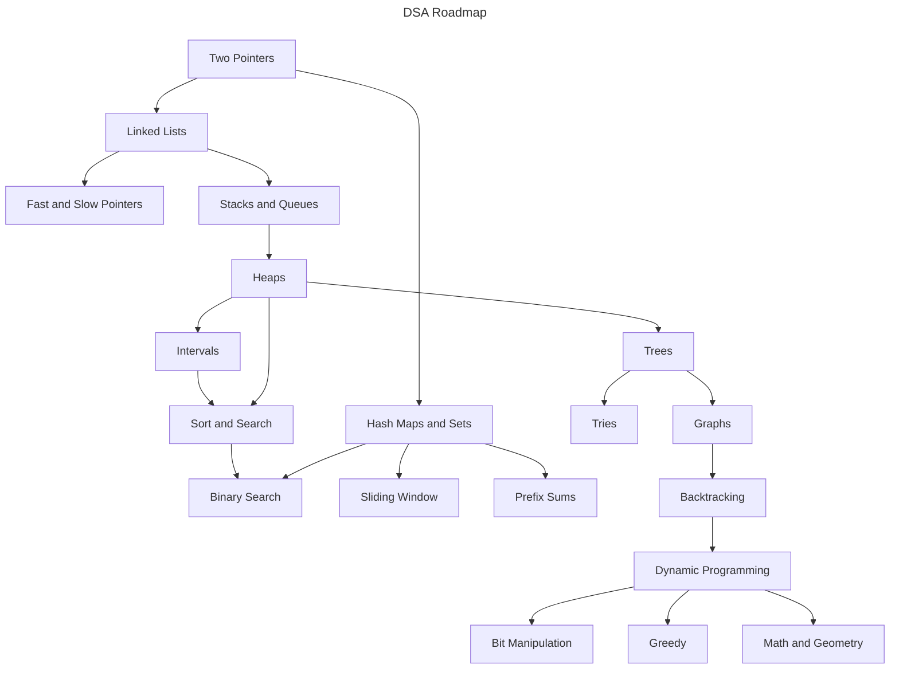

# LeetCode Patterns

Welcome to this **DSA roadmap** - a structured guide designed to help you **learn and master Data Structures and Algorithms (DSA)** efficiently.

## Why Did I Create This?

As a first-year university student, I set a goal to **master DSA as soon as possible** to prepare for my future career. Like many beginners, I started with **zero knowledge** about DSA and quickly realized that the vast number of coding problems available online was overwhelming. It was hard to figure out **where to start, what to focus on, and how to progress systematically**.

To solve this, I created this repository to **organize and simplify the learning process**. This roadmap is inspired by the [VNOI Roadmap](https://roadmap.sh/r/vnoi-roadmap), originally designed for **competitive programming**. However, I have adapted and restructured it to focus on **LeetCode-style problem-solving**, making it more suitable for **technical interviews and real-world coding assessments**.

## Prerequisites

Before diving into the roadmap, ensure you have a solid foundation in these key areas:

- Comfortable with at least **one programming language** (C++, Java, Python, etc.)
- Understanding of **basic programming concepts** (syntax, loops, functions, OOP)
- Familiarity with **arrays and linked lists**
- Basic knowledge of **recursion**
- Understanding of **Big-O notation** and **complexity analysis**
- Algebra fundamentals (**logarithms, exponents, modular arithmetic**)

## The Roadmap

This is my roadmap to learn DSA.

Each topic includes **curated LeetCode problems** and explanations to help you build a **strong problem-solving foundation**.

## Let's Go

### Two Pointers

- [ ] : Add introduction to Two Pointers

| Link                                                                                                            | Solutions                                               | Difficulty |
| --------------------------------------------------------------------------------------------------------------- | ------------------------------------------------------- | ---------- |
| [Valid Palindrome](https://leetcode.com/problems/valid-palindrome/)                                             | [C++](./C++/solutions_125/solutions_125.hpp)            | Easy       |
| [Remove Element](https://leetcode.com/problems/remove-element/)                                                 | [C++](./C++/solutions_27/solutions_27.hpp)              | Easy       |
| [Reverse String](https://leetcode.com/problems/reverse-string/)                                                 | [C++](./C++/solutions_344/solutions_344.hpp)            | Easy       |
| [Container With Most Water](https://leetcode.com/problems/container-with-most-water/)                           | [C++](./C++/solutions_11/solutions_11.hpp)              | Medium     |
| [Merge Two 2D Arrays by Summing Values](https://leetcode.com/problems/merge-two-2d-arrays-by-summing-values/)   | [C++](./C++/solutions_2570/solutions_2570.hpp)          | Easy       |
| [Remove Duplicates from Sorted Array](https://leetcode.com/problems/remove-duplicates-from-sorted-array/)       | [C++](./C++/solutions_26/solutions_26.hpp)              | Easy       |
| [Two Sum II - Input Array Is Sorted](https://leetcode.com/problems/two-sum-ii-input-array-is-sorted/)           | [C++](./C++/solutions_167/solutions_167.hpp)            | Medium     |
| [3Sum](https://leetcode.com/problems/3sum/)                                                                     | [C++](./C++/solutions_15/solutions_15.hpp)              | Medium     |
| [Longest Palindromic Substring](https://leetcode.com/problems/longest-palindromic-substring/)                   | [C++](./C++/solutions_5/solutions_5.hpp)                | Medium     |
| [Next Permutation](https://leetcode.com/problems/next-permutation/)                                             | [C++](./C++/solutions_31/solutions_31.hpp)              | Medium     |
| [Remove Duplicates from Sorted Array II](https://leetcode.com/problems/remove-duplicates-from-sorted-array-ii/) | [JavaScript](./JavaScript/solutions_80/solutions_80.js) | Medium     |

### Linked Lists

- [ ] : Add introduction to Linked Lists

| Link                                                                                                              | Solutions                                                 | Difficulty |
| ----------------------------------------------------------------------------------------------------------------- | --------------------------------------------------------- | ---------- |
| [Add Two Numbers](https://leetcode.com/problems/add-two-numbers/)                                                 | [C++](./C++/solutions_2/solutions_2.hpp)                  | Medium     |
| [Flatten a Multilevel Doubly Linked List](https://leetcode.com/problems/flatten-a-multilevel-doubly-linked-list/) | [C++](./C++/solutions_430/solutions_430.hpp)              | Medium     |
| [Remove Nth Node From End of List](https://leetcode.com/problems/remove-nth-node-from-end-of-list/)               | [C++](./C++/solutions_19/solutions_19.hpp)                | Medium     |
| [Middle of the Linked List](https://leetcode.com/problems/middle-of-the-linked-list/)                             | [C++](./C++/solutions_876/solutions_876.hpp)              | Easy       |
| [Intersection of Two Linked Lists](https://leetcode.com/problems/intersection-of-two-linked-lists/)               | [JavaScript](./JavaScript/solutions_160/solutions_160.js) | Easy       |
| [Linked List Cycle](https://leetcode.com/problems/linked-list-cycle/)                                             | [C++](./C++/solutions_141/solutions_141.hpp)              | Easy       |

### Hash Maps and Hash Sets

- [ ] : Add introduction to Hash Maps and Hash Sets

| Link                                                                                                          | Solutions                                                                                           | Difficulty |
| ------------------------------------------------------------------------------------------------------------- | --------------------------------------------------------------------------------------------------- | ---------- |
| [LRU Cache](https://leetcode.com/problems/lru-cache/)                                                         | [C++](./C++/solutions_146/solutions_146.hpp)                                                        | Medium     |
| [Two Sum](https://leetcode.com/problems/two-sum/)                                                             | [C++](./C++/solutions_1/solutions_1.hpp), [JavaScript](./JavaScript/solutions_1/solutions_1.js)     | Easy       |
| [Find Missing and Repeated Values](https://leetcode.com/problems/find-missing-and-repeated-values/)           | [C++](./C++/solutions_2965/solutions_2965.hpp)                                                      | Easy       |
| [Merge Two 2D Arrays by Summing Values](https://leetcode.com/problems/merge-two-2d-arrays-by-summing-values/) | [C++](./C++/solutions_2570/solutions_2570.hpp)                                                      | Easy       |
| [Number of Good Pairs](https://leetcode.com/problems/number-of-good-pairs/)                                   | [C++](./C++/solutions_1512/solutions_1512.hpp)                                                      | Easy       |
| [Roman to Integer](https://leetcode.com/problems/roman-to-integer/)                                           | [JavaScript](./JavaScript/solutions_13/solutions_13.js)                                             | Easy       |
| [Valid Sudoku](https://leetcode.com/problems/valid-sudoku/)                                                   | [C++](./C++/solutions_36/solutions_36.hpp)                                                          | Medium     |
| [Longest Consecutive Sequence](https://leetcode.com/problems/longest-consecutive-sequence/)                   | [JavaScript](./JavaScript/solutions_128/solutions_128.js)                                           | Medium     |
| [Set Matrix Zeroes](https://leetcode.com/problems/set-matrix-zeroes/)                                         | [C++](./C++/solutions_73/solutions_73.hpp) ,[JavaScript](./JavaScript/solutions_73/solutions_73.js) | Medium     |

### Sliding Window

- [ ] : Add introduction to Sliding Window

| Link                                                                                                                                        | Solutions                                      | Difficulty |
| ------------------------------------------------------------------------------------------------------------------------------------------- | ---------------------------------------------- | ---------- |
| [Longest Substring Without Repeating Characters](https://leetcode.com/problems/longest-substring-without-repeating-characters/)             | [C++](./C++/solutions_3/solutions_3.hpp)       | Medium     |
| [Number of Substrings Containing All Three Characters](https://leetcode.com/problems/number-of-substrings-containing-all-three-characters/) | [C++](./C++/solutions_1358/solutions_1358.hpp) | Medium     |
| [Longest Repeating Character Replacement](https://leetcode.com/problems/longest-repeating-character-replacement/)                           | [C++](./C++/solutions_424/solutions_424.hpp)   | Medium     |

### Binary Search

- [ ] : Add introduction to Binary Search

| Link                                                                                                                                              | Solutions                                                                                               | Difficulty |
| ------------------------------------------------------------------------------------------------------------------------------------------------- | ------------------------------------------------------------------------------------------------------- | ---------- |
| [Binary Search](https://leetcode.com/problems/binary-search/)                                                                                     | [C++](./C++/solutions_704/solutions_704.hpp)                                                            | Easy       |
| [Maximum Count of Positive Integer and Negative Integer](https://leetcode.com/problems/maximum-count-of-positive-integer-and-negative-integer/)   | [C++](./C++/solutions_2529/solutions_2529.hpp)                                                          | Easy       |
| [Find First and Last Position of Element in Sorted Array](https://leetcode.com/problems/find-first-and-last-position-of-element-in-sorted-array/) | [C++](./C++/solutions_34/solutions_34.hpp)                                                              | Medium     |
| [WoodCutting Made Easy](https://www.interviewbit.com/problems/woodcutting-made-easy/)                                                             | [C++](./C++/solutions_woodcutting/solutions_woodcutting.hpp)                                            | Medium     |
| [Search in Rotated Sorted Array](https://leetcode.com/problems/search-in-rotated-sorted-array/)                                                   | [C++](./C++/solutions_33/solutions_33.hpp)                                                              | Medium     |
| [Median of Two Sorted Arrays](https://leetcode.com/problems/median-of-two-sorted-arrays/)                                                         | [C++](./C++/solutions_4/solutions_4.hpp)                                                                | Hard       |
| [Search a 2D Matrix](https://leetcode.com/problems/search-a-2d-matrix/)                                                                           | [C++](./C++/solutions_74/solutions_74.hpp)                                                              | Medium     |
| [Find Peak Element](https://leetcode.com/problems/find-peak-element/)                                                                             | [C++](./C++/solutions_162/solutions_162.hpp)                                                            | Medium     |
| [Random Pick with Weight](https://leetcode.com/problems/random-pick-with-weight/)                                                                 | [C++](./C++/solutions_528/solutions_528.hpp), [JavaScript](./JavaScript/solutions_528/solutions_528.js) | Medium     |
