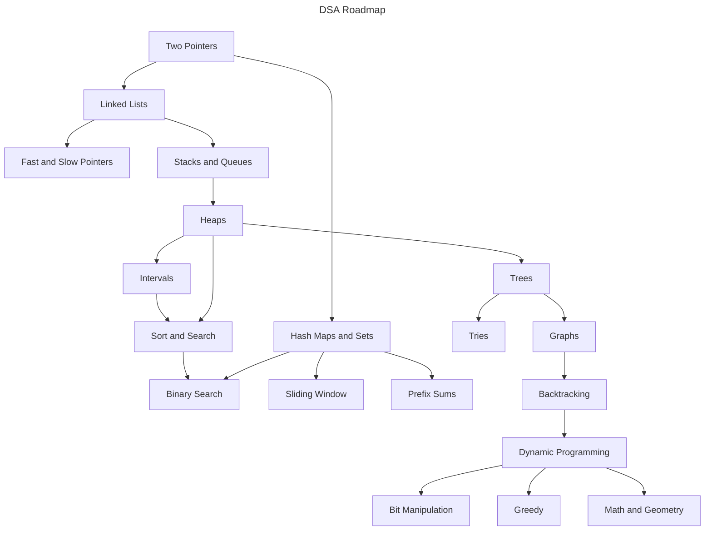

# LeetCode Patterns

Welcome to this **DSA Roadmap** - a structured guide designed to help you **learn and master Data Structures and Algorithms (DSA)** efficiently.

## 🌟 Why I Created This

As a first-year university student, I set a goal to **master DSA as soon as possible** to prepare for my future career. Like many beginners, I started with **zero knowledge** about DSA and quickly realized that the vast number of coding problems available online was overwhelming. It was hard to figure out **where to start, what to focus on, and how to progress systematically**.

To solve this, I created this repository to **organize and simplify the learning process**. This roadmap is inspired by the [VNOI Roadmap](https://roadmap.sh/r/vnoi-roadmap), originally designed for **competitive programming**. However, I have adapted and restructured it to focus on **LeetCode-style problem-solving**, making it more suitable for **technical interviews and real-world coding assessments**.

## 📚 Prerequisites

Before diving in, make sure you're comfortable with the following:

- One programming language (C++, Java, Python, etc.)
- Basic programming concepts (variables, loops, functions, OOP)
- Familiarity with arrays and linked lists
- Basic recursion
- Time and space complexity (Big-O notation)
- Algebra fundamentals (logarithms, exponents, modular arithmetic)

## 🗺️ The Roadmap

Here's the visual representation of my DSA learning path:

## 🚀 Getting Started

> [!NOTE]
> All solutions in this repository are written in **C++ only**. If you're not familiar with C++, I highly recommend learning the basic syntax and core concepts before diving into the problems.

### Linked Lists

| Link                                                              | Solutions                                | Difficulty |
| ----------------------------------------------------------------- | ---------------------------------------- | ---------- |
| [Add Two Numbers](https://leetcode.com/problems/add-two-numbers/) | [C++](./src/solutions_2/solutions_2.hpp) | Medium     |

### Hash Maps & Hash Sets

| Link                                              | Solutions                                | Difficulty |
| ------------------------------------------------- | ---------------------------------------- | ---------- |
| [Two Sum](https://leetcode.com/problems/two-sum/) | [C++](./src/solutions_1/solutions_1.hpp) | Easy       |

## 📌 Final Thoughts

This roadmap is a **living document**. I will continue to refine it as I grow and learn more.
Whether you're just starting out or revisiting DSA for interviews, I hope this resource helps guide your journey.

Happy coding! ✨
