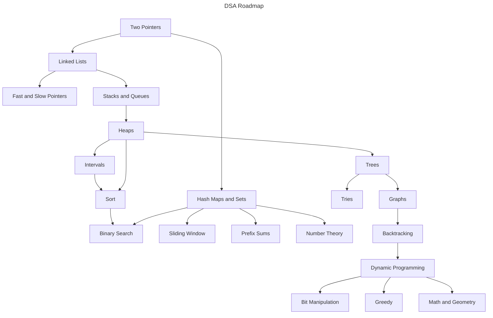

# LeetCode Patterns

Hello 😹, welcome to this LeetCode roadmap.

## 🗺️ The Roadmap

## 🚀 Let's Go

> [!NOTE]
> All solutions in this repository are written in **C++ only**. If you're not familiar with C++, I highly recommend learning the basic syntax and core concepts before diving into the problems. You can find a great resource for learning C++ [here](https://www.learncpp.com/).

### Two Pointers

| Link                                                                                          | Solutions           | Difficulty |
| --------------------------------------------------------------------------------------------- | ------------------- | ---------- |
| [Longest Palindromic Substring](https://leetcode.com/problems/longest-palindromic-substring/) | [C++](./src/005.cc) | Medium     |
| [Count and Say](https://leetcode.com/problems/count-and-say)                                  | [C++](./src/038.cc) | Medium     |

### Linked Lists

| Link                                                                           | Solutions           | Difficulty |
| ------------------------------------------------------------------------------ | ------------------- | ---------- |
| [Add Two Numbers](https://leetcode.com/problems/add-two-numbers/)              | [C++](./src/002.cc) | Medium     |
| [Reverse Linked List II](https://leetcode.com/problems/reverse-linked-list-ii) | [C++](./src/092.cc) | Medium     |

### Hash Maps and Sets

| Link                                              | Solutions           | Difficulty |
| ------------------------------------------------- | ------------------- | ---------- |
| [Two Sum](https://leetcode.com/problems/two-sum/) | [C++](./src/001.cc) | Easy       |

### Sliding Window

| Link                                                                                                                            | Solutions           | Difficulty |
| ------------------------------------------------------------------------------------------------------------------------------- | ------------------- | ---------- |
| [Longest Substring Without Repeating Characters](https://leetcode.com/problems/longest-substring-without-repeating-characters/) | [C++](./src/003.cc) | Medium     |

### Number Theory

| Link                                                        | Solutions           | Difficulty |
| ----------------------------------------------------------- | ------------------- | ---------- |
| [Count Primes](https://leetcode.com/problems/count-primes/) | [C++](./src/204.cc) | Medium     |

### Math and Geometry

| Link                                                                  | Solutions           | Difficulty |
| --------------------------------------------------------------------- | ------------------- | ---------- |
| [Palindrome Number](https://leetcode.com/problems/palindrome-number/) | [C++](./src/009.cc) | Easy       |

### Must do

| Link                                                                 | Solutions           | Difficulty |
| -------------------------------------------------------------------- | ------------------- | ---------- |
| [Zigzag Conversion](https://leetcode.com/problems/zigzag-conversion) | [C++](./src/006.cc) | Medium     |
