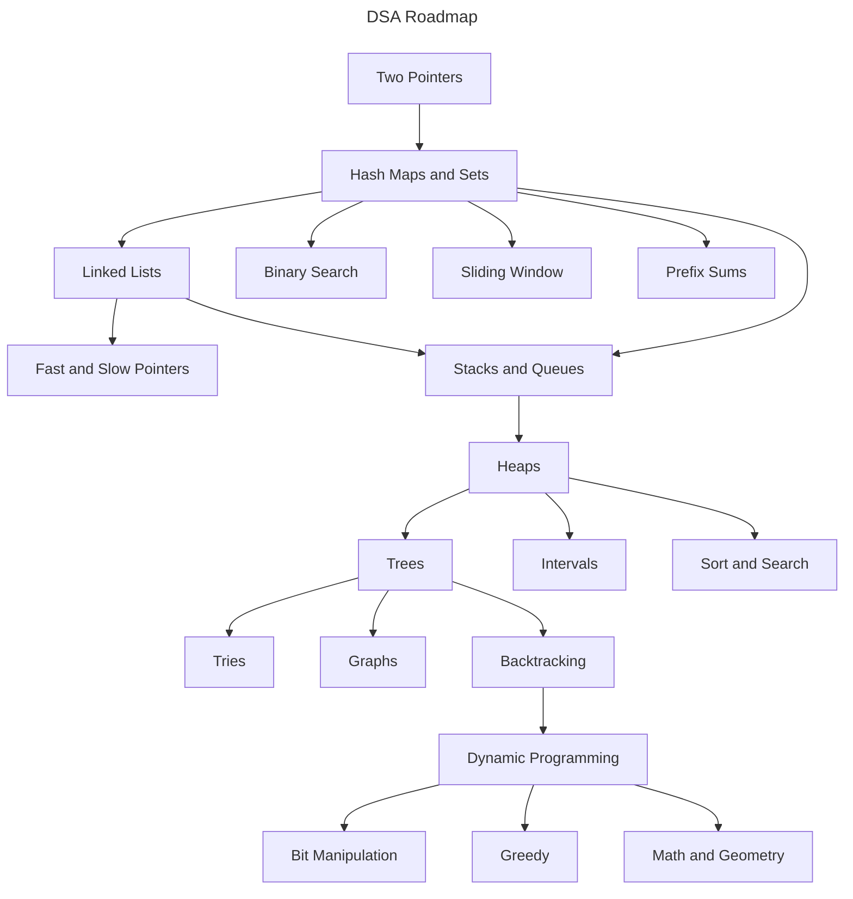

# LeetCode Patterns

Welcome to this DSA roadmap - a structured guide to help you learn and master **Data Structures and Algorithms (DSA)**.

**Why did I create this?**

I created this repository as a first-year university student with the goal of mastering DSA as soon as possible to prepare for my future career. Like many beginners, I started with **zero knowledge** about DSA and quickly realized that the amount of coding problems available online was overwhelming - it was hard to know where to start and what to focus on.

To solve that, I created this repository to organize and simplify the learning process. This roadmap is inspired by the [VNOI Roadmap](https://roadmap.sh/r/vnoi-roadmap), which is originally designed for **competitive programming**. I adapted and restructured it to fit the learning flow of someone who wants to focus on **LeetCode-style problem solving** - a more interview-oriented approach.

## Prerequisites

Before diving into these coding problems, It's important to ensure you have a solid foundation in a few key areas:

- Be comfortable with at least one coding language.
- Understand programming essentials: syntax, basic object-oriented programming, etc.
- Know about simple data structures like array and linked list.
- Be familiar with algebra, including logarithms and exponents.
- Understand the basic of recursion.
- Understand how Big O notation and complexity analysis work.

## The Roadmap

