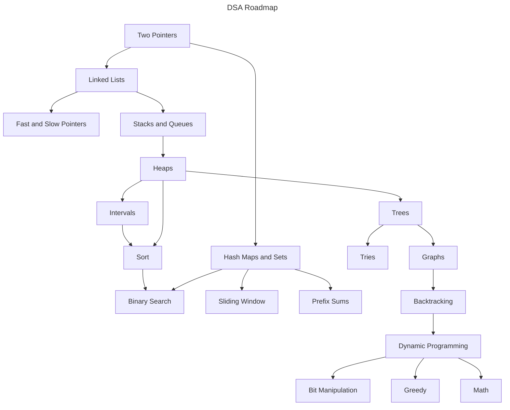

# DSA Roadmap

Hello, welcome to this DSA Roadmap. This is my personal DSA roadmap with LeetCode.

## 🗺️ The Roadmap

```mermaid
---
title: DSA Roadmap
---
flowchart TD
    %% Basic Foundations
    A[Two Pointers] --> B[Hash Maps and Sets]
    A --> C[Linked Lists]
    B --> E[Binary Search]
    B --> F[Sliding Window]
    B --> G[Prefix Sums]

    %% Intermediate Concepts
    C --> D[Fast and Slow Pointers]
    C --> J[Stacks and Queues]
    J --> R[Heaps]

    %% Advanced Data Structures
    R --> T[Trees]
    R --> W[Intervals]
    R --> Q[Sort]
    T --> U[Tries]
    T --> X[Graphs]
    X --> Y[Backtracking]

    %% Problem-Solving Techniques
    Y --> K[Dynamic Programming]
    K --> O[Bit Manipulation]
    K --> V[Greedy]
    K --> M[Math]

    %% Additional Paths
    W --> Q
    Q --> E
```

## 🚀 Let's Go

> [!NOTE]
> All solutions in this repository are written in **Rust**. If you're not familiar with Rust, I highly recommend learning the basic syntax and core concepts before diving into the problems. You can find a great resource for learning Rust [here](https://doc.rust-lang.org/book/).

### Two Pointers

| Link                                                                                                            | Solutions                                                            | Difficulty |
| --------------------------------------------------------------------------------------------------------------- | -------------------------------------------------------------------- | ---------- |
| [Valid Palindrome](https://leetcode.com/problems/valid-palindrome/)                                             | [Rust](./src/two_pointers/valid_palindrome.rs)                       | Easy       |
| [Remove Element](https://leetcode.com/problems/remove-element/)                                                 | [Rust](./src/two_pointers/remove_element.rs)                         | Easy       |
| [Is Subsequence](https://leetcode.com/problems/is-subsequence)                                                  | [Rust](./src/two_pointers/is_subsequence.rs)                         | Easy       |
| [Reverse String](https://leetcode.com/problems/reverse-string/)                                                 | [Rust](./src/two_pointers/reverse_string.rs)                         | Easy       |
| [Merge Two 2D Arrays by Summing Values](https://leetcode.com/problems/merge-two-2d-arrays-by-summing-values/)   | [Rust](./src/two_pointers/merge_two_2d_arrays_by_summing_values.rs)  | Easy       |
| [Merge Sorted Array](https://leetcode.com/problems/merge-sorted-array/)                                         | [Rust](./src/two_pointers/merge_sorted_arrays.rs)                    | Easy       |
| [Move Zeroes](https://leetcode.com/problems/move-zeroes)                                                        | [Rust](./src/two_pointers/move_zeros.rs)                             | Easy       |
| [Remove Duplicates from Sorted Array](https://leetcode.com/problems/remove-duplicates-from-sorted-array/)       | [Rust](./src/two_pointers/remove_duplicates_from_sorted_array.rs)    | Easy       |
| [Container With Most Water](https://leetcode.com/problems/container-with-most-water/)                           | [Rust](./src/two_pointers/container_with_most_water.rs)              | Medium     |
| [Two Sum II - Input Array Is Sorted](https://leetcode.com/problems/two-sum-ii-input-array-is-sorted/)           | [Rust](./src/two_pointers/two_sum.rs)                                | Medium     |
| [3Sum](https://leetcode.com/problems/3sum/)                                                                     | [Rust](./src/two_pointers/three_sum.rs)                              | Medium     |
| [Longest Palindromic Substring](https://leetcode.com/problems/longest-palindromic-substring/)                   | [Rust](./src/two_pointers/longest_palindromic_substring.rs)          | Medium     |
| [Next Permutation](https://leetcode.com/problems/next-permutation/)                                             | [Rust](./src/two_pointers/next_permutation.rs)                       | Medium     |
| [Remove Duplicates from Sorted Array II](https://leetcode.com/problems/remove-duplicates-from-sorted-array-ii/) | [Rust](./src/two_pointers/remove_duplicates_from_sorted_array_ii.rs) | Medium     |
| [Rotate Array](https://leetcode.com/problems/rotate-array)                                                      | [Rust](./src/two_pointers/rotate_array.rs)                           | Medium     |
| [4Sum](https://leetcode.com/problems/4sum)                                                                      | [Rust](./src/two_pointers/four_sum.rs)                               | Medium     |

### Linked Lists

| Link                                                                                                              | Solutions                                                            | Difficulty |
| ----------------------------------------------------------------------------------------------------------------- | -------------------------------------------------------------------- | ---------- |
| [Reverse Linked List](https://leetcode.com/problems/reverse-linked-list)                                          | [Rust](./src/linked_list/reverse_linked_list.rs)                     | Easy       |
| [Remove Linked List Elements](https://leetcode.com/problems/remove-linked-list-elements)                          | [Rust](./src/linked_list/remove_linked_list_elements.rs)             | Easy       |
| [Middle of the Linked List](https://leetcode.com/problems/middle-of-the-linked-list/)                             | [Rust](./src/linked_list/middle_of_the_linked_list.rs)               | Easy       |
| [Intersection of Two Linked Lists](https://leetcode.com/problems/intersection-of-two-linked-lists/)               | [Rust](./src/linked_list/intersection_of_two_linked_lists.rs)        | Easy       |
| [Linked List Cycle](https://leetcode.com/problems/linked-list-cycle/)                                             | [Rust](./src/linked_list/linked_list_cycle.rs)                       | Easy       |
| [Add Two Numbers](https://leetcode.com/problems/add-two-numbers/)                                                 | [Rust](./src/linked_list/add_two_numbers.rs)                         | Medium     |
| [Add Two Numbers II](https://leetcode.com/problems/add-two-numbers-ii)                                            | [Rust](./src/linked_list/add_two_numbers_ii.rs)                      | Medium     |
| [Reverse Linked List II](https://leetcode.com/problems/reverse-linked-list-ii)                                    | [Rust](./src/linked_list/reverse_linked_list_ii.rs)                  | Medium     |
| [Rotate List](https://leetcode.com/problems/rotate-list)                                                          | [Rust](./src/linked_list/rotate_list.rs)                             | Medium     |
| [Flatten a Multilevel Doubly Linked List](https://leetcode.com/problems/flatten-a-multilevel-doubly-linked-list/) | [Rust](./src/linked_list/flatten_a_multilevel_doubly_linked_list.rs) | Medium     |
| [Remove Nth Node From End of List](https://leetcode.com/problems/remove-nth-node-from-end-of-list/)               | [Rust](./src/linked_list/remove_nth_node_from_end_of_list.rs)        | Medium     |
| [Swap Nodes in Pairs](https://leetcode.com/problems/swap-nodes-in-pairs)                                          | [Rust](./src/linked_list/swap_nodes_in_pairs.rs)                     | Medium     |
| [Odd Even Linked List](https://leetcode.com/problems/odd-even-linked-list)                                        | [Rust](./src/linked_list/odd_even_linked_list.rs)                    | Medium     |

### Hash Maps and Hash Sets

| Link                                                                                                          | Solutions                                                       | Difficulty |
| ------------------------------------------------------------------------------------------------------------- | --------------------------------------------------------------- | ---------- |
| [Two Sum](https://leetcode.com/problems/two-sum/)                                                             | [Rust](./src/hash_map/two_sum.rs)                               | Easy       |
| [Find Missing and Repeated Values](https://leetcode.com/problems/find-missing-and-repeated-values/)           | [Rust](./src/hash_map/find_missing_and_repeated_values.rs)      | Easy       |
| [Merge Two 2D Arrays by Summing Values](https://leetcode.com/problems/merge-two-2d-arrays-by-summing-values/) | [Rust](./src/hash_map/merge_two_2d_arrays_by_summing_values.rs) | Easy       |
| [Number of Good Pairs](https://leetcode.com/problems/number-of-good-pairs/)                                   | [Rust](./src/hash_map/number_of_good_pairs.rs)                  | Easy       |
| [Roman to Integer](https://leetcode.com/problems/roman-to-integer/)                                           | [Rust](./src/hash_map/roman_to_integer.rs)                      | Easy       |
| [Contains Duplicate II](https://leetcode.com/problems/contains-duplicate-ii/)                                 | [Rust](./src/hash_map/contains_duplicate_ii.rs)                 | Easy       |
| [LRU Cache](https://leetcode.com/problems/lru-cache/)                                                         | [Rust](./src/hash_map/lru_cache.rs)                             | Medium     |
| [Valid Sudoku](https://leetcode.com/problems/valid-sudoku/)                                                   | [Rust](./src/hash_map/valid_sudoku.rs)                          | Medium     |
| [Longest Consecutive Sequence](https://leetcode.com/problems/longest-consecutive-sequence/)                   | [Rust](./src/hash_map/longest_consecutive_sequence.rs)          | Medium     |
| [Set Matrix Zeroes](https://leetcode.com/problems/set-matrix-zeroes/)                                         | [Rust](./src/hash_map/set_matrix_zeroes.rs)                     | Medium     |

### Sliding Window

| Link                                                                                                                                        | Solutions                                                                            | Difficulty |
| ------------------------------------------------------------------------------------------------------------------------------------------- | ------------------------------------------------------------------------------------ | ---------- |
| [Longest Substring Without Repeating Characters](https://leetcode.com/problems/longest-substring-without-repeating-characters/)             | [Rust](./src/sliding_window/longest_substring_without_repeating_characters.rs)       | Medium     |
| [Number of Substrings Containing All Three Characters](https://leetcode.com/problems/number-of-substrings-containing-all-three-characters/) | [Rust](./src/sliding_window/number_of_substrings_containing_all_three_characters.rs) | Medium     |
| [Longest Repeating Character Replacement](https://leetcode.com/problems/longest-repeating-character-replacement/)                           | [Rust](./src/sliding_window/longest_repeating_character_replacement.rs)              | Medium     |

### Binary Search

| Link                                                                                                                                              | Solutions                                                                              | Difficulty |
| ------------------------------------------------------------------------------------------------------------------------------------------------- | -------------------------------------------------------------------------------------- | ---------- |
| [Binary Search](https://leetcode.com/problems/binary-search/)                                                                                     | [Rust](./src/binary_search/binary_search_on_array.rs)                                  | Easy       |
| [Maximum Count of Positive Integer and Negative Integer](https://leetcode.com/problems/maximum-count-of-positive-integer-and-negative-integer/)   | [Rust](./src/binary_search/maximum_count_of_positive_integer_and_negative_integer.rs)  | Easy       |
| [Find First and Last Position of Element in Sorted Array](https://leetcode.com/problems/find-first-and-last-position-of-element-in-sorted-array/) | [Rust](./src/binary_search/find_first_and_last_position_of_element_in_sorted_array.rs) | Medium     |
| [Search in Rotated Sorted Array](https://leetcode.com/problems/search-in-rotated-sorted-array/)                                                   | [Rust](./src/binary_search/search_in_rotated_sorted_array.rs)                          | Medium     |
| [Search a 2D Matrix](https://leetcode.com/problems/search-a-2d-matrix/)                                                                           | [Rust](./src/binary_search/search_a_2d_matrix.rs)                                      | Medium     |
| [Find Peak Element](https://leetcode.com/problems/find-peak-element/)                                                                             | [Rust](./src/binary_search/find_peak_element.rs)                                       | Medium     |
| [Random Pick with Weight](https://leetcode.com/problems/random-pick-with-weight/)                                                                 | [Rust](./src/binary_search/random_pick_with_weight.rs)                                 | Medium     |
| [Median of Two Sorted Arrays](https://leetcode.com/problems/median-of-two-sorted-arrays/)                                                         | [Rust](./src/binary_search/median_of_two_sorted_arrays.rs)                             | Hard       |
| [Longest Increasing Subsequence](https://leetcode.com/problems/longest-increasing-subsequence)                                                    | [Rust](./src/binary_search/longest_increasing_subsequence.rs)                          | Medium     |

### Math

| Link                                                                                                                                                                   | Solutions                                                                                | Difficulty |
| ---------------------------------------------------------------------------------------------------------------------------------------------------------------------- | ---------------------------------------------------------------------------------------- | ---------- |
| [Stone Removal Game](https://leetcode.com/problems/stone-removal-game/)                                                                                                | [Rust](./src/math/stone_removal_game.rs)                                                 | Easy       |
| [Water Bottles](https://leetcode.com/problems/water-bottles/)                                                                                                          | [Rust](./src/math/water_bottles.rs)                                                      | Easy       |
| [Palindrome Number](https://leetcode.com/problems/palindrome-number/)                                                                                                  | [Rust](./src/math/palindrome_number.rs)                                                  | Easy       |
| [Largest Number At Least Twice of Others](https://leetcode.com/problems/largest-number-at-least-twice-of-others/)                                                      | [Rust](./src/math/largest_number_at_least_twice_of_others.rs)                            | Easy       |
| [Check if Number is a Sum of Powers of Three](https://leetcode.com/problems/check-if-number-is-a-sum-of-powers-of-three/)                                              | [Rust](./src/math/check_if_number_is_a_sum_of_powers_of_three.rs)                        | Medium     |
| [Reverse Integer](https://leetcode.com/problems/reverse-integer/)                                                                                                      | [Rust](./src/math/reverse_integer.rs)                                                    | Medium     |
| [Pow(x, n)](https://leetcode.com/problems/powx-n/)                                                                                                                     | [Rust](./src/math/pow.rs)                                                                | Medium     |
| [Basic Calculator II](https://leetcode.com/problems/basic-calculator-ii/)                                                                                              | [Rust](./src/math/basic_calculator_ii.rs)                                                | Medium     |
| [Rotate Image](https://leetcode.com/problems/rotate-image)                                                                                                             | [Rust](./src/math/rotate_image.rs)                                                       | Medium     |
| [String to Integer (atoi)](https://leetcode.com/problems/string-to-integer-atoi/)                                                                                      | [Rust](./src/math/string_to_integer_atoi.rs)                                             | Medium     |
| [Lexicographically Smallest Negated Permutation that Sums to Target](https://leetcode.com/problems/lexicographically-smallest-negated-permutation-that-sums-to-target) | [Rust](./src/math/lexicographically_smallest_negated_permutation_that_sums_to_target.rs) | Medium     |
| [Three Divisors](https://leetcode.com/problems/three-divisors)                                                                                                         | [Rust](./src/math/three_divisors.rs)                                                     | Easy       |
| [Ugly Number](https://leetcode.com/problems/ugly-number)                                                                                                               | [Rust](./src/math/ugly_number.rs)                                                        | Easy       |
| [Count Primes](https://leetcode.com/problems/count-primes/)                                                                                                            | [Rust](./src/math/count_primes.rs)                                                       | Medium     |
| [Closest Prime Numbers in Range](https://leetcode.com/problems/closest-prime-numbers-in-range/)                                                                        | [Rust](./src/math/closest_prime_numbers_in_range.rs)                                     | Medium     |

### Stacks and Queues

| Link                                                                                                                | Solutions                                                                 | Difficulty |
| ------------------------------------------------------------------------------------------------------------------- | ------------------------------------------------------------------------- | ---------- |
| [Remove All Adjacent Duplicates In String](https://leetcode.com/problems/remove-all-adjacent-duplicates-in-string/) | [Rust](./src/stack_and_queue/remove_all_adjacent_duplicates_in_string.rs) | Easy       |
| [Valid Parentheses](https://leetcode.com/problems/valid-parentheses/)                                               | [Rust](./src/stack_and_queue/valid_parentheses.rs)                        | Easy       |
| [Implement Queue using Stacks](https://leetcode.com/problems/implement-queue-using-stacks/)                         | [Rust](./src/stack_and_queue/implement_queue_using_stacks.rs)             | Easy       |
| [Next Greater Element II](https://leetcode.com/problems/next-greater-element-ii/)                                   | [Rust](./src/stack_and_queue/next_greater_element_ii.rs)                  | Medium     |
| [Decode String](https://leetcode.com/problems/decode-string)                                                        | [Rust](./src/stack_and_queue/decode_string.rs)                            | Medium     |
| [Basic Calculator](https://leetcode.com/problems/basic-calculator/)                                                 | [Rust](./src/stack_and_queue/basic_calculator.rs)                         | Hard       |
| [Sliding Window Maximum](https://leetcode.com/problems/sliding-window-maximum/)                                     | [Rust](./src/stack_and_queue/sliding_window_maximum.rs)                   | Hard       |

### Heaps

| Link                                                                                              | Solutions                                              | Difficulty |
| ------------------------------------------------------------------------------------------------- | ------------------------------------------------------ | ---------- |
| [Top K Frequent Elements](https://leetcode.com/problems/top-k-frequent-elements/)                 | [Rust](./src/heaps/top_k_frequent_elements.rs)         | Medium     |
| [Top K Frequent Words](https://leetcode.com/problems/top-k-frequent-words/)                       | [Rust](./src/heaps/top_k_frequent_words.rs)            | Medium     |
| [Kth Largest Element in an Array](https://leetcode.com/problems/kth-largest-element-in-an-array/) | [Rust](./src/heaps/kth_largest_element_in_an_array.rs) | Medium     |
| [Merge k Sorted Lists](https://leetcode.com/problems/merge-k-sorted-lists/)                       | [Rust](./src/heaps/merge_k_sorted_lists.rs)            | Hard       |
| [Find Median from Data Stream](https://leetcode.com/problems/find-median-from-data-stream/)       | [Rust](./src/heaps/find_median_from_data_stream.rs)    | Hard       |

### Intervals

| Link                                                                                      | Solutions                                              | Difficulty |
| ----------------------------------------------------------------------------------------- | ------------------------------------------------------ | ---------- |
| [Merge Intervals](https://leetcode.com/problems/merge-intervals/)                         | [Rust](./src/intervals/merge_intervals.rs)             | Medium     |
| [Interval List Intersections](https://leetcode.com/problems/interval-list-intersections/) | [Rust](./src/intervals/interval_list_intersections.rs) | Medium     |

### Prefix Sum

| Link                                                                                           | Solutions                                                  | Difficulty |
| ---------------------------------------------------------------------------------------------- | ---------------------------------------------------------- | ---------- |
| [Range Sum Query - Immutable](https://leetcode.com/problems/range-sum-query-immutable/)        | [Rust](./src/prefix_sum/range_sum_query_immutable.rs)      | Easy       |
| [Find the Middle Index in Array](https://leetcode.com/problems/find-the-middle-index-in-array) | [Rust](./src/prefix_sum/find_the_middle_index_in_array.rs) | Easy       |
| [Subarray Sum Equals K](https://leetcode.com/problems/subarray-sum-equals-k/)                  | [Rust](./src/prefix_sum/subarray_sum_equals_k.rs)          | Medium     |
| [Product of Array Except Self](https://leetcode.com/problems/product-of-array-except-self/)    | [Rust](./src/prefix_sum/product_of_array_except_self.rs)   | Medium     |
| [Minimum Size Subarray Sum](https://leetcode.com/problems/minimum-size-subarray-sum/)          | [Rust](./src/prefix_sum/minimum_size_subarray_sum.rs)      | Medium     |

### Trees

| Link                                                                                                                                                 | Solutions                                                                        | Difficulty |
| ---------------------------------------------------------------------------------------------------------------------------------------------------- | -------------------------------------------------------------------------------- | ---------- |
| [Binary Tree Inorder Traversal](https://leetcode.com/problems/binary-tree-inorder-traversal)                                                         | [Rust](./src/trees/binary_tree_inorder_traversal.rs)                             | Easy       |
| [Binary Tree Preorder Traversal](https://leetcode.com/problems/binary-tree-preorder-traversal)                                                       | [Rust](./src/trees/binary_tree_preorder_traversal.rs)                            | Easy       |
| [Binary Tree Postorder Traversal](https://leetcode.com/problems/binary-tree-postorder-traversal)                                                     | [Rust](./src/trees/binary_tree_postorder_traversal.rs)                           | Easy       |
| [Maximum Depth of Binary Tree](https://leetcode.com/problems/maximum-depth-of-binary-tree)                                                           | [Rust](./src/trees/maximum_depth_of_binary_tree.rs)                              | Easy       |
| [Symmetric Tree](https://leetcode.com/problems/symmetric-tree)                                                                                       | [Rust](./src/trees/symmetric_tree.rs)                                            | Easy       |
| [Invert Binary Tree](https://leetcode.com/problems/invert-binary-tree/)                                                                              | [Rust](./src/trees/invert_binary_tree.rs)                                        | Easy       |
| [Minimum Depth of Binary Tree](https://leetcode.com/problems/minimum-depth-of-binary-tree)                                                           | [Rust](./src/trees/minimum_depth_of_binary_tree.rs)                              | Easy       |
| [Balanced Binary Tree](https://leetcode.com/problems/balanced-binary-tree/)                                                                          | [Rust](./src/trees/balanced_binary_tree.rs)                                      | Easy       |
| [Path Sum](https://leetcode.com/problems/path-sum)                                                                                                   | [Rust](./src/trees/path_sum.rs)                                                  | Easy       |
| [Convert Sorted Array to Binary Search Tree](https://leetcode.com/problems/convert-sorted-array-to-binary-search-tree)                               | [Rust](./src/trees/convert_sorted_array_to_binary_search_tree.rs)                | Easy       |
| [Binary Tree Right Side View](https://leetcode.com/problems/binary-tree-right-side-view/)                                                            | [Rust](./src/trees/binary_tree_right_side_view.rs)                               | Medium     |
| [Maximum Width of Binary Tree](https://leetcode.com/problems/maximum-width-of-binary-tree/)                                                          | [Rust](./src/trees/maximum_width_of_binary_tree.rs)                              | Medium     |
| [Validate Binary Search Tree](https://leetcode.com/problems/validate-binary-search-tree/)                                                            | [Rust](./src/trees/validate_binary_search_tree.rs)                               | Medium     |
| [Kth Smallest Element in a BST](https://leetcode.com/problems/kth-smallest-element-in-a-bst)                                                         | [Rust](./src/trees/kth_smallest_element_in_a_bst.rs)                             | Medium     |
| [Lowest Common Ancestor of a Binary Tree](https://leetcode.com/problems/lowest-common-ancestor-of-a-binary-tree)                                     | [Rust](./src/trees/lowest_common_ancestor_of_a_binary_tree.rs)                   | Medium     |
| [Construct Binary Tree from Preorder and Inorder Traversal](https://leetcode.com/problems/construct-binary-tree-from-preorder-and-inorder-traversal) | [Rust](./src/trees/construct_binary_tree_from_preorder_and_inorder_traversal.rs) | Medium     |
| [Binary Tree Maximum Path Sum](https://leetcode.com/problems/binary-tree-maximum-path-sum)                                                           | [Rust](./src/trees/binary_tree_maximum_path_sum.rs)                              | Hard       |
| [Vertical Order Traversal of a Binary Tree](https://leetcode.com/problems/vertical-order-traversal-of-a-binary-tree)                                 | [Rust](./src/trees/vertical_order_traversal_of_a_binary_tree.rs)                 | Hard       |
| [Serialize and Deserialize Binary Tree](https://leetcode.com/problems/serialize-and-deserialize-binary-tree)                                         | [Rust](./src/trees/serialize_and_deserialize_binary_tree.rs)                     | Hard       |

### Tries

| Link                                                                                                                   | Solutions                                                         | Difficulty |
| ---------------------------------------------------------------------------------------------------------------------- | ----------------------------------------------------------------- | ---------- |
| [Longest Common Prefix](https://leetcode.com/problems/longest-common-prefix/)                                          | [Rust](./src/tries/longest_common_prefix.rs)                      | Easy       |
| [Implement Trie (Prefix Tree)](https://leetcode.com/problems/implement-trie-prefix-tree)                               | [Rust](./src/tries/implement_trie.rs)                             | Medium     |
| [Design Add and Search Words Data Structure](https://leetcode.com/problems/design-add-and-search-words-data-structure) | [Rust](./src/tries/design_add_and_search_words_data_structure.rs) | Medium     |
| [Word Search](https://leetcode.com/problems/word-search)                                                               | [Rust](./src/tries/word_search.rs)                                | Medium     |
| [Partition String](https://leetcode.com/problems/partition-string)                                                     | [Rust](./src/tries/partition_string.rs)                           | Medium     |
| [Word Search II](https://leetcode.com/problems/word-search-ii)                                                         | [Rust](./src/tries/word_search_ii.rs)                             | Hard       |

### Backtracking

| Link                                                                                                         | Solutions                                                           | Difficulty |
| ------------------------------------------------------------------------------------------------------------ | ------------------------------------------------------------------- | ---------- |
| [Permutations](https://leetcode.com/problems/permutations/)                                                  | [Rust](./src/backtracking/permutations.rs)                          | Medium     |
| [Permutations II](https://leetcode.com/problems/permutations-ii/)                                            | [Rust](./src/backtracking/permutations_ii.rs)                       | Medium     |
| [Combinations](https://leetcode.com/problems/combinations/)                                                  | [Rust](./src/backtracking/combinations.rs)                          | Medium     |
| [Letter Combinations of a Phone Number](https://leetcode.com/problems/letter-combinations-of-a-phone-number) | [Rust](./src/backtracking/letter_combinations_of_a_phone_number.rs) | Medium     |
| [Subsets](https://leetcode.com/problems/subsets/)                                                            | [Rust](./src/backtracking/subsets.rs)                               | Medium     |
| [Subsets II](https://leetcode.com/problems/subsets-ii)                                                       | [Rust](./src/backtracking/subsets_ii.rs)                            | Medium     |
| [Combination Sum](https://leetcode.com/problems/combination-sum)                                             | [Rust](./src/backtracking/combination_sum.rs)                       | Medium     |
| [Combination Sum II](https://leetcode.com/problems/combination-sum-ii)                                       | [Rust](./src/backtracking/combination_sum_ii.rs)                    | Medium     |
| [Longest Common Subsequence](https://leetcode.com/problems/longest-common-subsequence)                       | [Rust](./src/backtracking/longest_common_subsequence.rs)            | Medium     |
| [N-Queens](https://leetcode.com/problems/n-queens)                                                           | [Rust](./src/backtracking/n_queens.rs)                              | Hard       |
| [N-Queens II](https://leetcode.com/problems/n-queens-ii)                                                     | [Rust](./src/backtracking/n_queens_ii.rs)                           | Hard       |
| [Sudoku Solver](https://leetcode.com/problems/sudoku-solver)                                                 | [Rust](./src/backtracking/sudoku_solver.rs)                         | Hard       |

### Sorting

| Link                                                                     | Solutions                                    | Difficulty |
| ------------------------------------------------------------------------ | -------------------------------------------- | ---------- |
| [Sort an Array](https://leetcode.com/problems/sort-an-array/)            | [Rust](./src/sorting/sort_an_array.rs)       | Medium     |
| [Insertion Sort List](https://leetcode.com/problems/insertion-sort-list) | [Rust](./src/sorting/insertion_sort_list.rs) | Medium     |
| [Sort List](https://leetcode.com/problems/sort-list)                     | [Rust](./src/sorting/sort_list.rs)           | Medium     |
| [Sort Colors](https://leetcode.com/problems/sort-colors)                 | [Rust](./src/sorting/sort_colors.rs)         | Medium     |

### Dynamic Programming

| Link                                                                               | Solutions                                                     | Difficulty |
| ---------------------------------------------------------------------------------- | ------------------------------------------------------------- | ---------- |
| [Pascal's Triangle](https://leetcode.com/problems/pascals-triangle)                | [Rust](./src/dynamic_programming/pascal_triangle.rs)          | Easy       |
| [Pascal's Triangle II](https://leetcode.com/problems/pascals-triangle-ii)          | [Rust](./src/dynamic_programming/pascal_triangle_2.rs)        | Easy       |
| [Fibonacci Number](https://leetcode.com/problems/fibonacci-number)                 | [Rust](./src/dynamic_programming/fibonacci_number.rs)         | Easy       |
| [Climbing Stairs](https://leetcode.com/problems/climbing-stairs)                   | [Rust](./src/dynamic_programming/climbing_stairs.rs)          | Easy       |
| [Min Cost Climbing Stairs](https://leetcode.com/problems/min-cost-climbing-stairs) | [Rust](./src/dynamic_programming/min_cost_climbing_stairs.rs) | Easy       |
| [Coin Change](https://leetcode.com/problems/coin-change)                           | [Rust](./src/dynamic_programming/coin_change.rs)              | Medium     |
| [Minimum Cost For Tickets](https://leetcode.com/problems/minimum-cost-for-tickets) | [Rust](./src/dynamic_programming/minimum_cost_for_tickets.rs) | Medium     |
| [Unique Paths](https://leetcode.com/problems/unique-paths)                         | [Rust](./src/dynamic_programming/unique_paths.rs)             | Medium     |
| [Unique Paths II](https://leetcode.com/problems/unique-paths-ii)                   | [Rust](./src/dynamic_programming/unique_paths_ii.rs)          | Medium     |
| [Maximal Square](https://leetcode.com/problems/maximal-square)                     | [Rust](./src/dynamic_programming/maximal_square.rs)           | Medium     |
| [House Robber](https://leetcode.com/problems/house-robber)                         | [Rust](./src/dynamic_programming/house_robber.rs)             | Medium     |
| [Target Sum](https://leetcode.com/problems/target-sum)                             | [Rust](./src/dynamic_programming/target_sum.rs)               | Medium     |
| [Maximum Subarray](https://leetcode.com/problems/maximum-subarray)                 | [Rust](./src/dynamic_programming/maximum_subarray.rs)         | Medium     |
| [Minimum Path Sum](https://leetcode.com/problems/minimum-path-sum)                 | [Rust](./src/dynamic_programming/minimum_path_sum.rs)         | Medium     |
| [Coin Change II](https://leetcode.com/problems/coin-change-ii)                     | [Rust](./src/dynamic_programming/coin_change_ii.rs)           | Medium     |

### Greedy

| Link                                                                                                             | Solutions                                                       | Difficulty |
| ---------------------------------------------------------------------------------------------------------------- | --------------------------------------------------------------- | ---------- |
| [Maximize Sum Of Array After K Negations](https://leetcode.com/problems/maximize-sum-of-array-after-k-negations) | [Rust](./src/greedy/maximize_sum_of_array_after_k_negations.rs) | Easy       |
| [Can Place Flowers](https://leetcode.com/problems/can-place-flowers)                                             | [Rust](./src/greedy/can_place_flowers.rs)                       | Easy       |
| [Jump Game](https://leetcode.com/problems/jump-game)                                                             | [Rust](./src/greedy/jump_game.rs)                               | Medium     |
| [Gas Station](https://leetcode.com/problems/gas-station)                                                         | [Rust](./src/greedy/gas_station.rs)                             | Medium     |
| [Candy](https://leetcode.com/problems/candy)                                                                     | [Rust](./src/greedy/candy.rs)                                   | Hard       |

### Bit Manipulation

| Link                                                                                     | Solutions                                                     | Difficulty |
| ---------------------------------------------------------------------------------------- | ------------------------------------------------------------- | ---------- |
| [Number of Even and Odd Bits](https://leetcode.com/problems/number-of-even-and-odd-bits) | [Rust](./src/bit_manipulation/number_of_even_and_odd_bits.rs) | Easy       |
| [Power of Two](https://leetcode.com/problems/power-of-two/)                              | [Rust](./src/bit_manipulation/power_of_two.rs)                | Easy       |
| [Number of 1 Bits](https://leetcode.com/problems/number-of-1-bits/)                      | [Rust](./src/bit_manipulation/number_of_1_bits.rs)            | Easy       |
| [Reverse Bits](https://leetcode.com/problems/reverse-bits/)                              | [Rust](./src/bit_manipulation/reverse_bits.rs)                | Easy       |
| [Hamming Distance](https://leetcode.com/problems/hamming-distance/)                      | [Rust](./src/bit_manipulation/hamming_distance.rs)            | Easy       |

### Graph

| Link                                                                                       | Solutions                                           | Difficulty |
| ------------------------------------------------------------------------------------------ | --------------------------------------------------- | ---------- |
| [Find if Path Exists in Graph](https://leetcode.com/problems/find-if-path-exists-in-graph) | [Rust](./src/graph/find_if_path_exists_in_graph.rs) | Easy       |
| [Find Center of Star Graph](https://leetcode.com/problems/find-center-of-star-graph)       | [Rust](./src/graph/find_center_of_star_graph.rs)    | Easy       |
| [Flood Fill](https://leetcode.com/problems/flood-fill/)                                    | [Rust](./src/graph/flood_fill.rs)                   | Easy       |
| [Clone Graph](https://leetcode.com/problems/clone-graph)                                   | [Rust](./src/graph/clone_graph.rs)                  | Medium     |
| [Number of Islands](https://leetcode.com/problems/number-of-islands)                       | [Rust](./src/graph/number_of_islands.rs)            | Medium     |
| [Rotting Oranges](https://leetcode.com/problems/rotting-oranges)                           | [Rust](./src/graph/rotting_oranges.rs)              | Medium     |
| [Is Graph Bipartite?](https://leetcode.com/problems/is-graph-bipartite/)                   | [Rust](./src/graph/is_graph_bipartite.rs)           | Medium     |
